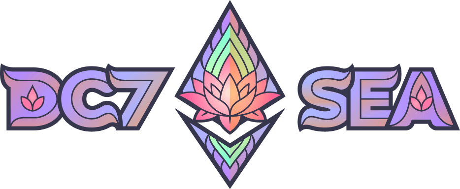

# The unofficial guide to Devcon 7 Southeast Asia

Made with ❤️ by local Ethereum communities in Southeast Asia.

## Sections

1. [Getting to know Southeast Asia](#getting-to-know-southeast-asia)
1. [Getting to know Thailand and Bangkok](#getting-to-know-thailand-and-bangkok)
1. [Thailand's Crypto Landscape](#thailand-s-crypto-landscape)
1. [Guide for Visitors](#guide-for-visitors)
1. [Guide for Visiting Teams](#guide-for-visiting-teams)
1. [Guide for Side Events](#guide-for-side-events)
1. [Guide for Nomads](#guide-for-nomads)
1. [Guide for Company Setup](#guide-for-company-setup)
1. [ข้อมูล Devcon สำหรับชาวไทย](#ข้อมูล-Devcon-สำหรับชาวไทย)

## Getting to know Southeast Asia

<!-- @todo #1 Add general overview of Southeast Asia -->
<!-- @todo #1 Add Southeast Asia's blockchain landscape -->
[contributions welcomed!]

## Getting to know Thailand and Bangkok

### Thailand

Thailand is a South “ETH” Asian country renowned for its stunning beaches, rich cultural heritage, mouth-watering cuisine and vibrant nightlife. With its flourishing economy and strategic location, Thailand has emerged as one of the fastest-growing economies in the region, attracting a growing number of entrepreneurs, builders and investors. Bangkok, the vibrant capital city of Thailand, is one of the top tourist destinations. It offers a wide range of attractions and experiences, from ancient temples, bustling street markets and cozy neighborhoods to luxurious shopping malls and world-class restaurants.

### Bangkok

Bangkok is a hotbed of tech talents, with over 100,000 local skilled IT professionals and a growing number of startups and digital nomads choosing to call Bangkok home. The city boasts several notable tech companies, web3 and blockchain projects - including early contributors to the Ethereum ecosystem, and modern and versatile event spaces supporting tech ecosystem. With that said, in addition to its affordable cost of living and great infrastructure, Bangkok makes itself an attractive destination that provides ample opportunities for the tech communities.

Whether you’re interested in exploring the city’s rich history and culture, networking with fellow tech professionals, or organizing an international event, Bangkok has something to offer to everyone.

<!-- @todo #1 Add more content about Thailand and Bangkok in general (non-crypto) -->
[contributions welcomed!]

## Thailand's Crypto Landscape

Bangkok and Thailand overall has a thriving crypto community and a supportive regulatory environment that supports innovation and technological advancement. The Thai government has recognized the potential of blockchain technology and has made it a priority in its national development strategy, with initiatives like the Thailand 4.0 policy that seeks to leverage emerging technologies to transform the country’s economy and society.

The country’s Securities and Exchange Commission (SEC) has implemented progressive regulations for digital assets, including cryptocurrency exchange platforms and ICO portals, paving the way for the growth of the crypto industry. Furthermore, Thailand’s central bank, the Bank of Thailand, has developed its own blockchain-based platform for interbank transfers and a pilot version of Central Bank Digital Currency (CBDC) for Thailand.

The Ethereum community in Bangkok consists of various project teams, companies, communities and university clubs. Numerous Ethereum-related events have been organized at least since 2018 including conferences and builder’s activities. The list below illustrates the current Ethereum community, and not by any means exhaustive.

### Communities and projects

The Ethereum community in Bangkok consists of various project teams, companies, communities and university clubs. Numerous Ethereum-related events have been organized at least since 2018 including conferences and builder’s activities. The list below illustrates the current Ethereum community, and not by any means exhaustive.

- Online communities: [Blockchain Developer Thailand](https://www.facebook.com/groups/879466468887478/), [Ethereum Optimism Thailand](https://www.facebook.com/groups/415118605919440), [Blockchain Security Thailand](https://www.facebook.com/groups/2506416166158656/), [Bitcoin Addict](https://bitcoinaddict.org/), [Katinrun](https://www.facebook.com/Katinrun/)
- University clubs: [CU Blockchain Society](https://www.facebook.com/cubs2020/), [KU Blockchain Society](https://www.facebook.com/KUBCS/), [Mahidol Blockchain Club](https://www.facebook.com/mahidolblockchainclub/), [KMUTT Blockchain Club](https://www.facebook.com/KMUTTBlockchain)
- Data: [Ape Board](https://apeboard.finance/dashboard), [Nansen](https://www.nansen.ai/) (Bangkok Hub), [TokenUnlocks](https://token.unlocks.app/)
- DeFi: [Alpha Venture DAO](https://alphaventuredao.io/), [Band Protocol](https://bandprotocol.com/), [Arken](https://arken.finance/), [KillSwitch](https://www.killswitch.finance/), [Kulap](https://www.kulap.io/), [FWX](https://fwx.finance/), [Firo](https://firo.org/), [Tangible](https://twitter.com/tangiblefinance)
- Tools: [Laika Labs](https://getlaika.app/), [Uniswap.fish](https://uniswap.fish/), [Speedboat Studio](https://speedboat.studio/)
- Services: [SmartContract Blockchain Studio](https://www.smartcontractthailand.com/), [Atato](https://www.atato.com/), [Inspex](https://inspex.co/)
- Gaming & Metaverse: [GuildFi](https://guildfi.com/), [Translucia](https://www.translucia.com/)
- Exchanges & Brokerages: [Bitkub](https://www.bitkub.com/en), [InnovestX](https://www.innovestx.co.th/home), [Orbix](https://www.orbixtrade.com/)
- EVM chains: [Bitkub Chain](https://www.bitkubchain.com/), [ThaiChain](https://www.thaichain.io/), [REI Chain](https://www.reichain.io/)
- NFT projects: [3Landers](https://3landersnft.com/), [Gangster All Stars](https://www.gangsterallstar.com/), [Apetimism](https://apetimism.com/), [BoredTown](https://guild.xyz/boredtown)
- Investments/Institutions: [SCB 10X](https://www.scb10x.com/), [TokenX](https://www.tokenx.finance/), [Crytomind](https://cryptomind.group/), [Beacon VC](https://www.beaconvc.fund/), [Kasikorn X](https://kx.tech/), [Krungsri Finnovate](https://www.krungsrifinnovate.com/en/Home)

### Past events

- [EthPadThai: Christmas 2023](https://twitter.com/ethpadthai/status/1738633827881513084)
- [EthPadThai at Blockchain Genesis Thailand 2023](https://twitter.com/ethpadthai/status/1723303233647779907)
- [MuChiangMai](https://twitter.com/themu_xyz/status/1704143599405826341)
- [Antalpha HackerHouse: #ZKP at Chiang Mai](https://labs.antalpha.com/hackerhouse/chiangmai/)
- [REDeFiNE TOMORROW 2023](https://www.facebook.com/SCB10X/videos/182792507718974)
- [Blockchain Thailand Genesis](https://www.facebook.com/blockchainthailandevent/posts/pfbid0gnWCtL9JcDahBqL7f44i9WVofRAD4FkPNiz8yY7Ry3yC2fgYMEv94S46yJXURhHHl) by Cryptomind Group, 2018 - 2023
- Blockchain Security Level Up, [0x00](https://www.facebook.com/InspexCo/posts/288648826739625), [0x01](https://www.facebook.com/InspexCo/posts/350371997233974), [0x02](https://www.facebook.com/InspexCo/posts/426348572969649)
- [REDeFiNE TOMORROW 2022](https://www.facebook.com/SCB10X/videos/redefine-tomorrow-2022-event-wrap-up/1224092851495058)
- Chainlink Thailand events with [over 54 events so far](https://www.meetup.com/chainlink-thailand-connected-smart-contracts/)
- [REDeFiNE TOMORROW 2021](https://www.facebook.com/SCB10X/videos/redefine-tomorrow-2021-global-defi-blockchain-virtual-summit/502425231032892/)
- [ETHBKK](https://pages.atato.com/ethbkk-2022-0) by Atato, 2020 - 2023
- [REDeFiNE TOMORROW 2020](https://www.youtube.com/watch?v=IulUYXAGGq4)
- [Ethereum Fireside Chat](https://blockspaper.com/th/article/31), November 2019
- [Asia-Pacific Ethereum Community Meetup](https://medium.com/cryptoage/crypto-savetheintenet-cd89d5fac918), February 2018
- [ETHBKK](https://www.eventpop.me/e/3612-ethbangkok-meetup-june-2018) by OmiseGO, June 2018
- [Katinrun Meetups](https://www.facebook.com/Katinrun)

### Past hackathons and bootcamps

- [Pizza Hackathon 2018](https://nuuneoi.com/blog/blog.php?read_id=942)
- [SCB 10X Blockathon 2021](https://www.facebook.com/SCB10X/posts/pfbid02JVZusc48vkL5oqicM3fgA8p3we4HHz4SC4jKFZFLRBaBRSUwv9jKaCENzpitc968l), [SCB 10X Metathon 2022](https://www.facebook.com/SCB10X/posts/pfbid023q9byRw7iC8NhaGMw4TgsgiLNL9cXsDKg6hJiZYz4UdaE2cLYy17kHRqi7oMQs5el), [SCB 10X BlockCamp](https://www.facebook.com/SCB10X/posts/pfbid0DNdKVmq67zVvYQBxvLks1tV7GC3T1amQqakUHtMFPsKnrqZEbz2xG6moFyD9S67ul), [SCB 10X Blockathon 2023](https://www.facebook.com/SCB10X/videos/1896242250750040/)
- [Bitkub Bootcamp](https://www.techtalkthai.com/bitkub-academy-blockathon-boot-camp-2/)
- [CBDC Hackathon](https://www.bot.or.th/Thai/BOT80/CBDCHackathon/Pages/default.aspx) by Bank of Thailand

## Guide for Visitors

### Visa

- Citizens of many countries are entitled for Visa Exemption and Visa on Arrival to Thailand. Here is the [list of countries and period of stay information](https://image.mfa.go.th/mfa/0/N3nQs9OUac/Visa_Exemption_and_Visa_on_Arrival_to_Thailand/VOA_30.9.65.pdf)
- Travelers can easily check if they need a tourist visa under [FAQ section](https://www.thaievisa.go.th/).
- Thai E-visa applications are available via https://www.thaievisa.go.th/
- Starting from January 9, 2023, Covid-19 restrictions are lifted. Travelers entering Thailand are not required to show Proof of Vaccination or COVID-19 test results.
- More information can be found at [Thailand Travel Restrictions 2023 | ThaiEmbassy.com](https://www.thaiembassy.com/travel-to-thailand/thailand-travel-restrictions-2023)

### International Airports

Bangkok, as the capital city of Thailand, is a major transportation hub due to its strategic location and is well-connected internationally. It is located in the center of Southeast Asia, which is just a few hours away by plane from other major cities in the countries nearby including Singapore, Vietnam, the Philippines and Malaysia. There are 2 international airports in Bangkok: Suvarnabhumi Airport (BKK) and Don Mueang International Airport (DMK).

1. [Suvarnabhumi Airport (BKK)](https://suvarnabhumi.airportthai.co.th/) has direct flights to over 120 destinations worldwide in 48 countries with more than 65 million passengers in pre-pandemic period. It is conveniently connected to the city center: 25-30 minutes via Airport Rail Link (ARL) train and 45-75 minutes via Airport Shuttle Bus or taxi to popular destinations in central Bangkok.
2. [Don Mueang International Airport (DMK)](https://donmueang.airportthai.co.th/) connects to over 40 destinations worldwide, with approximately 26 countries, primarily in Asia. Airport Shuttle Buses, skytrains, metros and taxis are available to travel to the city center of Bangkok.

### Airport Transit

There are several transportation options to get to the city from both airports, Suvarnabhumi Airport (BKK) and Don Mueang International Airport (DMK):

#### Recommended Options from Suvarnabhumi Airport to Bangkok

- Airport Rail Link (ARL): The Airport Rail Link City Line Train is the cheapest option to travel to Bangkok. The train station runs every 10-15 minutes from 6:00 AM to midnight. Travel takes 30 minutes and costs between $0.4-1.3, depending on the destination. See [Train Route Map](https://www.urbanrail.net/as/bang/bangkok.htm).
- Airport shuttle bus: Airport shuttle buses are a more affordable option than taxis, and they operate between the airport and several major hotels and destinations in the city. It costs around $1.5-4.4 for a ride, depending on the destination. See [AI Bangkok Bus Line Map](https://www.transitbangkok.com/lines/bangkok-bus-line/A1) and [Limo Express Bus Map](https://www.limobus.co.th/).
- Taxi: Taxis are available at the airport 24/7. Price is calculated using a taximeter, so based on the time and distance traveled. Thus the final fare will depend on traffic conditions and your accommodation’s exact location. In general, it costs around $7 for a ride to the city center.
- See [Map for all Transport Options](https://iamkohchang.com/wp-content/uploads/2016/05/Public-Transportation-at-Suvarnabhumi-Airport.pdf)

#### Recommended Options from Don Mueang International Airport to Bangkok

- Airport shuttle bus: The cheapest option is to take the A1 bus as a one-way only costs $0.9, no matter where one chooses to stop. The Airport Limo Express bus is a little more expensive, costing $4.4 to get to Khao San station which can be booked online in advance at a small fee, or one can buy tickets on the day.
- Taxi: Cost of the journey from Don Mueang depends on the time and distance traveled.
- Private alternatives: Taxi, grab.

### Transportation

Transportation in Bangkok is quite cheap. For a taxi, it costs ~ $1 for the first 2 km then increases ~ $0.2 per km afterwards. For skytrains and metros, it costs around $0.5-2 one-way. Therefore, you should be able to navigate around Bangkok for $10 each day.

With a variety of options for travel around the city that is cheaper compared to other Southeast Asian countries, anyone can make the most of their time here without worrying about costs.

- BTS Skytrain: the most convenient and cheapest option for traveling around Bangkok. The BTS covers most of the popular tourist areas in central Bangkok
- MRT Subway: another convenient and cheap option for transport. The MRT runs through the city center and connects to other areas. They can get crowded during peak hours, but they are fast and affordable
- Private/pricier alternatives: taxi, Grab

### Accommodation

Accommodations in Bangkok are reasonably priced and most offer great amenities. Budget hotels or hostels, mid-range hotels and luxury hotels cost from $10-20, $30-90 and upwards of $150 per night, respectively.

### Safety and political stability

Thailand is generally considered a safe country for travelers and tourists. It ranked 8th in safe travel destinations in 2022 according to [a survey by Berkshire Hathaway Travel Protection](https://www.cnbc.com/2022/04/28/americans-view-asian-nations-as-safer-for-travel-now-than-4-years-ago.html). However, petty crimes such as pickpocketing, theft or scam can occur, but violent crime against foreigners is relatively rare.

In terms of political stability, Thailand has experienced some political unrest and protests over the past few years. In recent years, however, the country has been relatively stable.

Regarding religious beliefs, Thailand is predominantly a Buddhist country, but it is also known for its neutrality and openness to other cultures and beliefs.

### Climate

Overall, Bangkok, Thailand has a tropical monsoon climate and is hot and humid year-round, with average daily highs ranging from 31-35°C (88-95°F) and nighttime lows around 24-26°C (75-79°F).

Q4 (October to December) is considered the cooler and drier season in Bangkok. It occasionally drops down to 20°C (68°F) in December for a couple days. On average, there are 6-10 days of rainfall each month during Q4.

### Things to do

If you have some time to spare after the event and after networking with crypto enthusiasts around Bangkok, make sure to give some of these attractions a try to complete the local yet diverse experience in Thailand:

- Arts / Cultures: Delve into Thai culture by exploring the Grand Palace, Wat Phra Kaew and Wat Arun which are Thailand’s most famous historical temples, and why not give Thai martial arts a try by joining Muay Thai training courses. If you appreciate the arts, immerse yourself in Thailand’s contemporary art scenes by local artists at Bangkok Art and Culture Centre (BACC)

- Food / Cuisines: Dine on a luxurious boat while cruising down the Chao Phraya River for breathtaking views of Bangkok’s landmarks. Alternatively, you can go shopping and eat local street food at Chatuchak Weekend Market as well as trying out several Asian local foods at Chinatown’s Yaowarat Road and Sukhumvit Koreatown

- Nature: Take a breather from the bustling city life by taking a walk or riding a bike around Bang Krajao, the peaceful green oasis known as the Green Lung of Bangkok. You can also take a relaxing stroll or jog around Benjakitti Park. To see Thai’s traditional way of living, visit Damnoen Saduak floating markets for the real experience

## Guide for Visiting Teams

<!-- @todo #1 Add guide to organizing off-site in Thailand -->
[contributions welcomed!]

## Guide for Side Events

### Side Events in Bangkok

Bangkok has several venues suitable for hosting side events located around Bangkok. Some of the popular options that offer meeting rooms, event spaces and supporting catering and audio-visual equipment rental include:

- The Hive
- Launchpad
- The Great Room
- The Commons

Find below locations that are perfect for hanging and networking that have hosted side events during the [2022 Blockchain Thailand Genesis](https://www.blockchain-th.com/side-event/):

- Central World Groove
- Worldtigo, Banyan Tree Bangkok (previous event: It’s ok to meet up 2022)
- Novotel Siam Bangkok (previous event: Genesis Demo Day 2022)
- Cleverse, Rungrojthanakul Building (previous event: DeFi Sunday)
- Verve Rachada Bangkok (previous event: Aceplore Bangkok 2022 networking party

<!-- @todo #1 Add more side event venue options -->
[contributions welcomed!]

### Side Events out of Bangkok

<!-- @todo #1 Add guide to organizing side events out of Bangkok -->
[contributions welcomed!]

## Guide for Nomads

<!-- @todo #1 Add visa information for nomads -->
[contributions welcomed!]

## Guide for Company Setup

<!-- @todo #1 Add info on business registration -->
<!-- @todo #1 Add info on registering a web3 startup business -->
<!-- @todo #1 Add info on applying for BOI company -->
[contributions welcomed!]

## ข้อมูล Devcon สำหรับชาวไทย

Devcon เป็นงานสัมมนาของนักพัฒนาใน Ethereum ecosystem ที่ใหญ่ที่สุดในโลก งาน Devcon ครั้งที่ผ่านมา (Devcon 6) ถูกจัดขึ้นที่เมืองโบโกตา ประเทศโคลัมเบีย ในช่วงเดือนตุลาคม 2565 มีผู้เข้าร่วมงานกว่า 6,000 คน และสปีกเกอร์กว่า 350 คน ตลอดงานทั้ง 4 วัน นอกจากนี้งาน Devcon 6 ยังก่อให้เกิดงานคู่ขนานหรือ side events อีกกว่า 300+ งาน ดึงนักพัฒนา วิศวกรซอฟท์แวร์ และผู้ความสามารถอื่นๆ ทั่วโลก เข้าไปสัมผัสและถ่ายทอดความรู้มากมายให้กับบุคลากรของประเทศผู้จัด และก่อให้เกิดเงินสะพัดในเศรษฐกิจเมืองอีกนับไม่ถ้วน

ในการจัดงาน Devcon 7 ที่กรุงเทพในช่วงพฤศจิกายน 2567 นี้ เราหวังว่าจะก่อให้เกิดการถ่ายทอดความรู้ เสริมสร้างและพัฒนาอุตสาหกรรมซอฟท์แวร์และบล็อกเชน รวมถึงดึงดูดเงินเข้าประเทศไทย กระตุ้นให้เกิดการจับจ่ายใช้สอยและการท่องเที่ยวอีกมาก

### ศึกษางาน Devcon 6 ที่ผ่านมา
- บล็อกสรุปงานอย่างเป็นทางการ (ภาษาอังกฤษ): https://blog.ethereum.org/en/2022/11/17/devcon-vi-wrap
- วีดีโอสรุป: https://www.youtube.com/watch?v=lgTMm7J0t7c
- วีดีโอทอล์คทั้งหมด: https://archive.devcon.org/archive/playlists/devcon-6/

### ท่านสามารถมีส่วนร่วมกับ Devcon 7 ได้อย่างไร?

- ติดตามการเปิดขายตั๋วเข้าร่วมงานที่ https://devcon.org/en/
- จัดงานหรือกิจกรรมที่เกี่ยวข้องกับการวิจัยและพัฒนา Ethereum และขอ grant จาก https://esp.ethereum.foundation/devcon-grants
- สมัครเข้าร่วมงาน ETHGlobal Bangkok hackathon: https://ethglobal.com/events/bangkok
- ร่วมเป็นสปอนเซอร์งาน ETHGlobal Bangkok hackathon: https://ethglobal.com/partner

## Credits

This guide's content was bootstrapped from the [Devcon 7 Location Proposal for Bangkok](https://forum.devcon.org/t/proposed-location-bangkok-thailand/2546). While initially drafted by the team at [SCB 10X](https://twitter.com/SCB10X_OFFICIAL), it was proposed as a community-wide effort to invite Devcon 7 to Bangkok.

The location proposal was contributed, reviewed and supported by the following teams and individuals:

- [Alpha Venture DAO](https://alphaventuredao.io/)
- [Arken](https://arken.finance/)
- [Crytomind](https://cryptomind.group/)
- Fabien 📸
- [Impossible Finance](https://impossible.finance/)
- [GuildFi](https://guildfi.com/)
- [Inspex](https://inspex.co/)
- [Katinrun](https://www.facebook.com/Katinrun/)
- [KillSwitch](https://www.killswitch.finance/)
- [KULAP](https://www.kulap.io/)
- [REI Chain](https://www.reichain.io/)
- [Laika Labs](https://getlaika.app/)
- [SCB 10X](https://www.scb10x.com/)
- [SmartContract Blockchain Studio](https://www.smartcontractthailand.com/)
- [Speedboat Studio](https://speedboat.studio/)
- [Tangible](https://twitter.com/tangiblefinance)
- [TokenUnlocks](https://token.unlocks.app/)
- [Uniswap.fish](https://uniswap.fish/)

## Maintainer

While this guide is open to contributions, it is currently maintained by [EthPadThai](https://twitter.com/ethpadthai) team:

- Twitter: https://twitter.com/ethpadthai
- Telegram: https://t.me/ethpadthai
- Website: https://ethpadthai.org/

## License

This guide is licensed under [Creative Commons Attribution 4.0 International (CC-BY-4.0)](https://creativecommons.org/licenses/by/4.0/).
